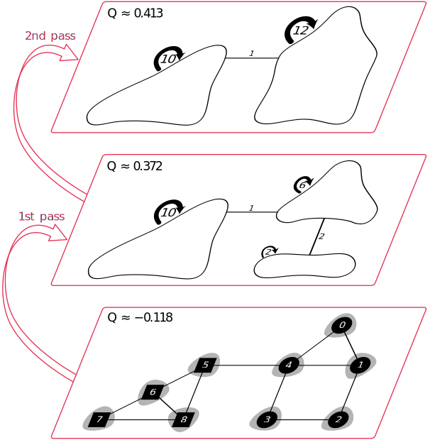

<p align="center">
        <a href="https://splines.github.io/fast-louvain/">
            
        </a>
        <h2 align="center">Fast Louvain</h3>
      <p align="center">Rust implementation of the Louvain algorithm for community detection in large networks.</p>   
</p>

Works on undirected, weighted graphs (weights are optional).

| :arrows_counterclockwise:   | This project is currently a work in progress. Once a first workable version is accomplished, I will publish a release. |
|---------------|:-------------------------|

| :scroll:   | The [documentation book](https://splines.github.io/fast-louvain/) (work in progress) includes a detailed description of modularity (including derivations of formulas) and the Louvain algorithm. It explains and motivates the use of the Louvain method and illustrates key aspects with images, e.g. this one: |
|---------------|:-------------------------|


<p align="center">
    <a href="https://splines.github.io/fast-louvain/">
        
    </a>
</p>


## Build & Run
```
cargo run --bin louvain
```

## Test
Run all unit tests of every workspace.
```
cargo test --lib --locked --workspace
```

## Documentation book
We use the [`mdbook-katex`](https://github.com/lzanini/mdbook-katex) preprocessor, so you should install it first:
```
cargo install mdbook-katex
```

Then build, watch and open the documentation book:
```
mdbook watch ./docs --open
```


<!-- References -->
<details>
<summary><h2>References</h2></summary>

- TODO
</details>

<!-- License -->
<details>
<summary><h2>License</h2></summary>

The source code of this program is licensed with the very permissive MIT license, see the [LICENSE file](https://github.com/Splines/raspi-captive-portal/blob/main/LICENSE) for details. When you use this project (e.g. make a fork that becomes its own project), I do not require you to include the license header in every source file, however you must include it at the root of your project. According to the MIT license you must also include a copyright notice, that is, link back to this project, e.g. in this way:

> [Fast Louvain](https://github.com/splines/fast-louvain) - Copyright (c) 2023 Splines

Any questions regarding the license? [This FAQ](https://www.tawesoft.co.uk/kb/article/mit-license-faq) might help.

Note that the [documentation book](https://splines.github.io/fast-louvain/) is exempt from the MIT license. Redistribution of the documentation book is not permitted. Yet, you are welcome to reference it in your own work.

</details>

