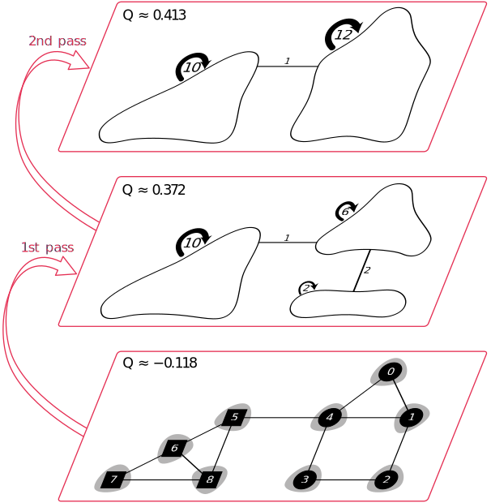

# Louvain algorithm

> **🚨 This page is a work in progress.**

The Louvain method -- named after the University of Louvain where Blondel et al. developed the algorithm -- finds communities by optimizing [**modularity**](../modularity/formula.md) locally for every node’s neighborhood, then consolidating the vertices of newly found communities to super vertices and repeating the steps on the new, smaller graph (see original [paper](https://perso.uclouvain.be/vincent.blondel/publications/08BG.pdf)). This multi-step algorithm ends when modularity does not improve in one pass anymore. It has been shown to yield state-of-the-art results with very good performance which is linear in the number of edges $m$ in the graph (see [here](https://arxiv.org/pdf/0908.1062.pdf)).

We demonstrate and explain the Louvain algorithm with the following undirected and unweighted graph. The [source code](https://github.com/splines/fast-louvain) can deal with weighted graphs as well.

<figure class="center">
    
    <figcaption>Initial singleton communities</figcaption>
</figure>

We assume we somehow know the communities in the graph a priori. This known vertex-community assignment is oftentimes called the **"ground truth"**. In our sampel graph, we have two communities that the Louvain algorithm should find in the end since it optimizes modularity.

$$
\Cs_{\text{ground truth}} = \{ c_0, c_1 \} = \bigl\{ \{0, 1, 2, 3, 4\}, \{5, 6, 7, 8\} \bigr\}
$$

The two ground-truth communities are denoted by the shape of the vertices (either a circle or a square). In the background, we draw in gray areas around the vertices to indicate the communities that the algorithm found in each step.

**Initially each vertex gets assigned to its own community** that we will call "singleton community" (mathematically speaking a set consisting of just one element, e.g. $\{4\}$). Therefore, we have this partition:

$$
\Cs = \bigl\{ \{0\}, \{1\}, \{2\}, \{3\}, \{4\}, \{5\}, \{6\},\{7\},\{8\} \bigr\}
$$

> 🎈 **Task**: Calculate the modularity $Q$ for the initial partition and assume a weight of 1 for every edge. Obviously, $Q$ shouldn't be very high.

## I. Modularity optimization

After the initial assignment to singleton communities, the first step of one Louvain pass is essentially to apply Newman’s agglomerative hierarchical clustering method presented [here](https://doi.org/10.1103/PhysRevE.69.066133) and improved by Clauset, Newman, and Moore [here](https://doi.org/10.1103%2Fphysreve.70.066111):

> "[S]tarting with each vertex being the sole member of a community of one, we repeatedly join together the two communities whose amalgamation produces the largest increase in $Q$." ~ from [here](https://doi.org/10.1103%2Fphysreve.70.066111)

In the Louvain method, this is done by iterating over all vertices (in randomized order): a vertex $u$ is then "moved" to the community of one of its neighbors $v\in \Neigh(u)$, so that the modularity gain $\Delta Q$ is maximized (this is why Louvain is a *greedy* algorithm). If no positive gain is possible, $u$ remains in its singleton community.

In the following figure, some vertices were already gather to communities, e.g. vertices $5$, $6$, $7$ and $8$ on the left and vertices $0$ and $1$ on the right belong together accoridng to the current state of the algorithm.

<figure class="center">
    
    <figcaption>Louvain optimization phase in first pass: Delta modularity calculation for vertex 4.</figcaption>
</figure>

At this point, we consider vertex $u=4$ and its neighbors $\Neigh(4) = \{0, 1, 3, 5\}$. The highest increase is $\Delta Q \approx 0.097$ when the community of vertices $0$ and $1$ accommodates vertex $4$, hence $4$ is "moved" to this community. An efficient calculation of $\Delta Q$ is derived in the next section. We consider vertices multiple times until modularity cannot be increased anymore which corresponds to a local maximum. The following figure illustrates the community assignments as result of the first local optimization phase.

<figure class="center">
    
    <figcaption>Louvain optimization phase in first pass: Result of local optimization.</figcaption>
</figure>

## II. Community aggregation (consolidation)

**In the second phase, the communities that were found in the first phase are replaced by super vertices**. This results in a new graph where vertices are the communities of phase I. Consider the middle layer of the following figure showing the outcome of the first pass after phase I and II.

<figure class="center">
    
    <figcaption>Resulting Louvain hierarchy for the sample graph. Communities of the previous pass become the new super vertices.</figcaption>
</figure>

Edges now have a weight assigned to them, even though we started with an unweighted graph:

- Edges *between* communities (inter-community edges) are condensed to one edge
between the communities with edge weight equal to the sum of the weight of all
previous edges between the communities.
- Edges *within* communities (intra-community edges) result in self-loops with a
weight of value two in order to account for the undirectedness (see calculations in [modularity section](../modularity/formula.md)).

## Termination

**These two phases make one pass of the Louvain algorithm**. The first phase works
directly on the graph that emerges from the second phase (the new super vertices are
considered to lie in their own singleton communities). Passes are executed repeatedly
while modularity is always calculated with respect to the original graph. **The algorithm ends when modularity cannot be increased anymore** (hopefully corresponding to a global maximum), which is often the case after a handful of passes, even for large networks (see [here](https://perso.uclouvain.be/vincent.blondel/publications/08BG.pdf)).

Capturing the resulting community-vertex assignment after each pass produces a hierarchy (that we've already seen) since the second step creates super-vertices based on the previous vertices of a community and thus the local optimization phase essentially finds communities of communities. Blondel et al. remark that this is favorable in order to reveal hierarchical structures present in many large networks. They also point out that the resolution limit is mitigated as vertices are moved one after another, yielding a low probability of merging two distinct communities. Even if the super vertices of the respective communities are merged in later passes, the resulting hierarchy helps in identifying on which "organization level" this merge took place (see [here](https://perso.uclouvain.be/vincent.blondel/publications/08BG.pdf)).
