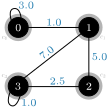
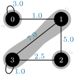

# Modularity calculation examples

We've given an intuition for the quality function **modularity** that is defined as follows with [two equivalent formulas](./formula.md):

$$
\begin{align}
Q(\Cs) &\coloneqq 
\frac{1}{2m} \sum_{c\in \Cs} \sum_{u\in c} \sum_{v\in c}
    \left( A_{uv} - \frac{k_u k_v}{2m} \right)\\
&= \frac{1}{2m} \sum_{c\in \Cs} \left( \Sigma_c
- \frac{\left(\Sigma_{\hat{c}}\right)^2}{2m} \right)
\end{align}
$$

Let's see it in action with some examples.

## Weighted graph with singleton communities

Consider the following graph

<figure class="center">
    
    <figcaption>A simple weighted test graph</figcaption>
</figure>

Its adjacency matrix is given by:

$$
A = \begin{pmatrix}
    3 & 1 & 0 & 0\\
    1 & 0 & 5 & 7\\
    0 & 5 & 0 & 2.5\\
    0 & 7 & 2.5 & 1
\end{pmatrix}
$$

$$
\Cs = \{ c_1, c_2, c_3, c_4 \} = \Bigl\{ \{0\}, \{1\}, \{2\}, \{3\}, \{4\} \Bigr\}
$$

$$
m = \frac{1}{2} \sum_{u,v} A_{uv} = \frac{1}{2} (3 + 2 + 10 + 14 + 5 + 1) = 17.5
$$

$$
\begin{align}
Q(\Cs) &\coloneqq \frac{1}{2m} \sum_{c\in C} \sum_{u\in c} \sum_{v\in c}
\biggl( \underbrace{A_{uv} - \frac{k_u k_v}{2m}}_{\eqqcolon \phi} \biggr)\\
&= \frac{1}{2m}
\biggl[ \, \sum_{u,v \in c_1} \phi + \sum_{u,v \in c_2} \phi
+ \sum_{u,v \in c_3} \phi + \sum_{u,v \in c_4} \phi \biggr]\\
% 
&= \frac{1}{2m}
\biggl[
    \Bigl( A_{00} - \frac{k_0 k_0}{2m} \Bigr)
    + \Bigl( A_{11} - \frac{k_1 k_1}{2m} \Bigr)
    + \Bigl( A_{22} - \frac{k_2 k_2}{2m} \Bigr)
    + \Bigl( A_{33} - \frac{k_3 k_3}{2m} \Bigr)
\biggr]\\
% 
&= \frac{1}{35} \cdot
\biggl[
    \Bigl( 3 - \frac{4^2}{35} \Bigr)
    + \Bigl( 0 - \frac{13^2}{35} \Bigr)
    + \Bigl( 0 - \frac{7.5^2}{35} \Bigr)
    + \Bigl( 1 - \frac{10.5^2}{35} \Bigr)
\biggr]\\
% 
&= - \frac{423}{2450} \approx -0.17265
\end{align}
$$

We can also use the second equivalent formulation to get to the same result:

$$
\begin{align}
Q(\Cs) &= \frac{1}{2m} \sum_{c\in \Cs} \left( \Sigma_c
- \frac{\left(\Sigma_{\hat{c}}\right)^2}{2m} \right)\\
%
&= \frac{1}{35} \biggl[
    \Bigl( 3 - \frac{4^2}{35} \Bigr)
    + \Bigl( 0 - \frac{13^2}{35} \Bigr)
    + \Bigl( 0 - \frac{7.5^2}{35} \Bigr)
    + \Bigl( 1 - \frac{10.5^2}{35} \Bigr)
\biggr]\\
% 
&= - \frac{423}{2450} \approx -0.17265
\end{align}
$$

The difference between the two formulations is not apparent in this example as we only consider singleton communities here (every vertex is in its own community).

## Weighted graph with other communities

<figure class="center">
    
    <figcaption>The same weighted test graph as before with a different vertex-community assignment</figcaption>
</figure>

We now have a different vertex-community assignment. The partitioning $\Cs$ shown in the figure is given by:
$$
\Cs = \{ c1, c_2, c_3\} = \bigl\{ \{0\}, \{1,3\}, \{2\}\bigr\}
$$