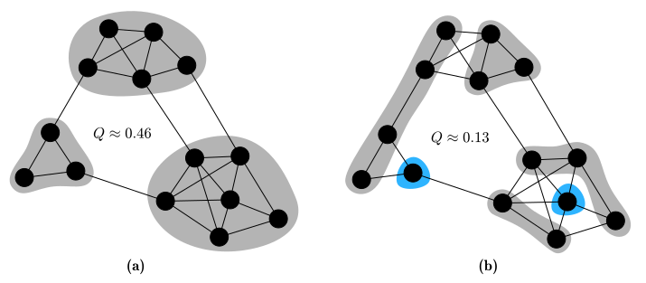

# Modularity

> **🚨 This page is a work in progress.**

## Motivation

We are often faced with networks whose underlying community structure is not known in advance, yet still, we need a measure to evaluate how good our proposed partition of the network into communities is. This is especially important when dealing with algorithms requiring an objective function to maximize (e.g. genetic algorithms).
[Newman and Girvan](https://doi.org/10.1103%2Fphysreve.70.066111) proposed a measure called modularity in 2003, which was adopted [broadly and successfully](https://doi.org/10.1016/j.physrep.2009.11.002) in the network research community. **Modularity $Q$ is maximized for divisions of a graph when many edges fall within the proposed communities (intra-community edges) as compared to edges between communities (inter-community edges)**.

The following figure depicts a contrived network with different vertex-community assignments. The intuitive grouping of vertices into communities in (a) leads to the maximal achievable modularity value of $Q ≈ 0.46$ for this particular graph. This grouping is characterized by only sparse connections between communities which are in themselves densely connected. In contrast, figure (b) results in a lower value of just $Q ≈ 0.13$. We will discuss the possible range of modularity values later on.

<figure class="center">
    
    <figcaption>Simple network with different proposed vertex-community assignments. (a) shows the optimal grouping of vertices into three communities, while (b) depicts a bad grouping into five communities. The blue community even induces a disconnected subgraph. Image inspired by <a href="https://www.pnas.org/doi/full/10.1073/pnas.0601602103">this paper</a>.</figcaption>
</figure>

## Configuration model & modularity formula

In the following, we assume a graph $G$ with $∣V (G)∣ = n$ vertices and $∣E(G)∣ = m$ edges. The edge set $E(G)$ is determined by the adjacency matrix[^graph-repr] $A$ with entries:

$$
A_{uv} = \begin{cases}
    1, &\text{if } u \text{ and } v \text{ are neighbors},\\
    0, &\text{otherwise}
\end{cases}
$$

Of all the edges, **a high fraction of edges that connect vertices in the same community** should give a good partition. For a specific community $c$, this fraction is given by

$$
e_c = \frac{1}{2m} \sum_{u\in c} \sum_{v\in c} A_{uv}
$$

where we iterate over all edges ${u, v}$ with both ends in community $c$. We divide by $m$ to retrieve the fraction of all edges. The factor $2$ comes from the assumption that we only deal with undirected edges, so every edge occurs twice for every order of arguments ($A_{uv}$ and $A_{vu}$). We call this term $e_c$ in accordance with [here](https://doi.org/10.1103/PhysRevE.70.066111). Aiming for

$$
\max \sum_{c\in \Cs} e_c
$$

with $\Cs$ being the set of all proposed communities, makes sure a high fraction of edges is within communities (and not between). However, the trivial case with all vertices in the same community yields a maximum value of $1$. Therefore, we cannot use this measure alone, but instead compare this fraction of intra-community edges with the expected number of intra-community edges *if edges were distributed at random in our graph*. Note that “random” does not mean any arbitrary graph, instead, the following properties should be preserved to allow for a fair comparison:

1. The number of nodes $n$
2. The number of edges $m$
3. The vertex degree $k_v$ for all vertices $v\in V(G)$.

We employ the configuration model as null model (as seen [here](https://doi.org/10.1103%2Fphysreve.69.026113)). A new, “empty” graph with $n$ nodes is constructed and $m$ edges are randomly inserted between vertices whilst ignoring their (potentially known) community structure.

In order to analyze the expected fraction of edges between any nodes $u$ and $v$ in a community, we cut every edge into two halves, leaving only edge stubs on the vertices as shown in the next figure. Since we have $m$ edges in our graph, we end up with $2m$ edge stubs. There are $k_v$ ways to connect one edge stub of vertex $u$ (marked in red) to any edge stub of $v$ (marked in blue). Randomly, we could connect this one edge stub of $u$ to any of the $2m− 1$ edge stubs in the entire graph [^edge-stubs-self-loops]. Hence, the probability that one edge stub of $u$ connects to any edge stub of $v$ in our random graph is given by $\frac{k_v}{2m-1}$. As vertex $u$ has $k_u$ edge stubs, the probability that vertex $u$ connects to vertex $v$, i. e. any edge stub of $u$ connects to any edge stub of $v$, is given by

$$
p(u,v) = \frac{k_u k_v}{2m-1}
$$

<figure class="center">
    
    <figcaption>Configuration model with $k_u = 6$ and $k_v = 5$. One possible edge between stubs is shown as dashed line.
    </figcaption>
</figure>

This yields the equation for the expected number of edges that fall within a
community $c$ if edges were distributed randomly in the graph while preserving
node degrees:

$$
\boxed{
a_c^2 \coloneqq \frac{1}{2m} \sum_{u \in c} \sum_{v\in c} \frac{k_u k_v}{2m}
}
$$

The same reasoning as before applies here for the term $\frac{1}{2m}$. Since we are dealing with big networks where $2m ≫ 1$, it is reasonable to drop the aforementioned “$−1$” in the denominator, which is common in literature (see [here](https://doi.org/10.1103/PhysRevE.70.066111) and [here](https://doi.org/10.1073%2Fpnas.0601602103)). Again, to show the connection to the original definition of modularity by Newman and Girvan, we refer to this term as $a_c^2$, where for any community $c$, we define $a_c$ as:

$$
a_c = \frac{1}{2m} \sum_{v\in c} k_v
$$

This denotes the fraction of edge stubs (out of all $\approx 2m$ edge stubs in the graph) that are attached to vertices in community $c$. One could also refer to this as the total vertex degree of vertices in community $c$ divided by twice the number of edges in the graph $2m$.

By combining $e_c$ with $a_c^2$ and by iterating over all communities $c\in \Cs$, we get:
$$
\begin{align}
Q(\Cs) &\coloneqq \bigl( \text{fraction of edges that fall within the proposed communities}\bigr)\\
&\quad - \bigl(\text{expected fraction of such edges in a random graph}\bigr)\\
&= \sum_{c\in \Cs} (e_c - a_c^2)\\
&= \sum_{c\in \Cs} \left(
    \frac{1}{2m} \sum_{u\in c} \sum_{v\in c} A_{uv}
- \frac{1}{2m} \sum_{u\in c} \sum_{v\in c} \frac{k_u k_v}{2m}
\right)
\end{align}
$$

This gives us the definition of modularity that is often found in literature. We can use this measure as **q**uality function for algorithms, rendering the problem of community detection into that of modularity optimization. Note that the variable $Q$ stands for "quality" [^quality].

$$
\boxed{
    Q(\Cs) = \frac{1}{2m} \sum_{c\in \Cs} \sum_{u\in c} \sum_{v\in c}
    \left( A_{uv} - \frac{k_u k_v}{2m} \right)
}
$$

While we only consider undirected (and possibly weighted) graphs here, modularity can be extended to directed graphs as well, as seen [here](https://doi.org/10.1088/1367-2630/9/6/176) and [here](https://hal.archives-ouvertes.fr/hal-01231784).

## Alternative formulation

An alternative formulation of modularity is used [here](https://arxiv.org/pdf/physics/0608255.pdf). Both variants are equal as we can transform them into each other. We will use the following identity to get from the first to the second line:

$$
\sum_{i=1}^n \sum_{j=1}^n x_i x_j = \left(\sum_{k=1}^n x_k\right)^2
$$

$$
\begin{align}
Q(\Cs) &= \sum_{c\in \Cs}
\left( \sum_{u\in c} \sum_{v\in c} \frac{A_{uv}}{2m}
- \sum_{u\in c} \sum_{v\in c} \frac{k_u k_v}{2m} \frac{1}{2m}\right)\\
&= \sum_{c\in \Cs}
\left( \sum_{u\in c} \sum_{v\in c} \frac{A_{uv}}{2m}
- \left(\frac{\sum_{v\in c} k_v}{2m}\right)^2\right)\\
&= \sum_{c\in \Cs} \left( \frac{\Sigma_c}{2m}
- \left(\frac{\Sigma_{\hat{c}}}{2m}\right)^2 \right)\\
&= \frac{1}{2m} \sum_{c\in \Cs} \left( \Sigma_c
- \frac{\left(\Sigma_{\hat{c}}\right)^2}{2m} \right)\\
\end{align}
$$

$$
\boxed{
Q(\Cs) = \frac{1}{2m} \sum_{c\in \Cs} \left( \Sigma_c
- \frac{\left(\Sigma_{\hat{c}}\right)^2}{2m} \right)
}
$$

with $\Sigma_c = \sum_{u\in c} \sum_{v \in c} A_{uv}$ and $\Sigma_{\hat{c}} = \sum_{v\in c} k_v$. Here, $\Sigma_{\hat{c}}$ is the sum of the weights of edges incident to vertices in $c$ (including self-loops), while $\Sigma_c$ is the sum of the weights of edges inside the community[^weights-inside]. This is the actual formula used in the code.

> **"This reveals an inherent trade-off: To maximize the first term [inside the parantheses], many edges should be contained in clusters, whereas the minimization of the second term is achieved by splitting the graph into many clusters with small total degrees each."** ~ from [here](https://doi.org/10.1109/TKDE.2007.190689)

> 🎈 **Task**: We motivated the introduction of a negative term in the modularity formula by this observation: "However, the trivial case with all vertices in the same community yields a maximum value of 1." Make sure you understand why this is the case. Take a look at the definition of $e_c$.

<!-- Footnotes -->
---

[^graph-repr]: Note that this is just the representation of the graph for this book, not for the actual Rust code.

[^edge-stubs-self-loops]: The "$-1$" is introduced because an edge stub cannot connect to itself in the configuration model. However, this still allows for self-loops as one edge stub could connect to another one on the same vertex.

[^quality]: Modularity is just one quality function (out of many others) that we will discuss here as it has been widely adopted in literature.

[^weights-inside]: For undirected graphs, this is actually twice the sum of the weights of edges except for self-loops since they are counted only once (they are on the main diagonal of the adjacency matrix).
