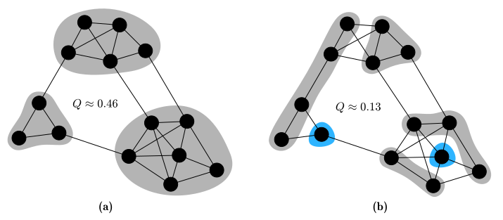

# Modularity

> **🚨 This page is a work in progress.**

## Motivation

We are often faced with networks whose underlying community structure is not known in advance, yet still, we need a measure to evaluate how good our proposed partition of the network into communities is. This is especially important when dealing with algorithms requiring an objective function to maximize (e.g. genetic algorithms).
[Newman and Girvan](https://doi.org/10.1103%2Fphysreve.70.066111) proposed a measure called modularity in 2003, which was adopted [broadly and successfully](https://doi.org/10.1016/j.physrep.2009.11.002) in the network research community. **Modularity \\( Q \\) is maximized for divisions of a graph when many edges fall within the proposed communities (intra-community edges) as compared to edges between communities (inter-community edges)**.

The following figure depicts a contrived network with different vertex-community assignments. The intuitive grouping of vertices into communities in (a) leads to the maximal achievable modularity value of \\( Q ≈ 0.46 \\) for this particular graph. This grouping is characterized by only sparse connections between communities which are in themselves densely connected. In contrast, figure (b) results in a lower value of just \\( Q ≈ 0.13 \\). We will discuss the possible range of modularity values later on.

