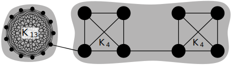

# Modularity resolution limit

> **🚨 This page is a work in progress.**

Fortunato and Barthélemy have shown that modularity suffers from a resolution limit, implying that optimizing for modularity does not necessarily reveal the actual community structure of the network (see [here](https://www.pnas.org/doi/pdf/10.1073/pnas.0605965104)). Two communities might get combined into a larger one, yielding a higher modularity. This is the case for communities where $m_c < \sqrt{m/2}$, i.e. **the number of edges inside community $c$ is too small for the grouping of vertices to be recognized as one community**.

Note that the notion of "community" is defined in the "weak" sense as in [this paper](https://arxiv.org/pdf/cond-mat/0309488.pdf): "In a weak community the sum of all degrees within [the subgraph] is larger than the sum of all degrees toward the rest of the network". In the mathematical definition of modularity, however, what is considered a community is dependent on the size of the whole network (number of edges $m$) – which is not ideal.

Fortunato and Barthélemy point out the importance of further investigation of the modules found by an algorithm that optimizes for modularity since one does not know if a claimed "module" is really just one community or a combination of multiple communities. Special care is required for communities with

$$
\boxed{
    m_c < \sqrt{m/2}
}
$$

as they are likely to be composed of two or more smaller[^smaller] ones (this number results from merging the two biggest, but still unrecognizable modules together). Yet, even bigger modules could suffer from this constraint of modularity if they are -- as the authors call it -- "fuzzy", meaning that they have an increasing number of external edges (edges to other modules), making the difference between internal and external edges smaller.

<figure class="center">
    
    <figcaption>Network consisting of two $K_4$ and one $K_{13}$ clique. The former are not correctly identified as individual communities when optimizing for modularity. $Q_{\text{single}} \approx 0.239$ ($K_4$ cliques identified as single communities), $Q_{\text{pair}} \approx 0.240$ ($K_4$ cliques grouped together as a pair).</figcaption>
</figure>

The above figure illustrates the resolution limit in an extreme example. The two cliques (complete graphs $K_4$) on the right are interconnected by one single edge ("bridge") and share just one edge with the rest of the network, yet they are not recognized as two individual communities; optimal modularity assigns all eight vertices to the same community. The clique $K_{13}$ may be an arbitrary graph with $\geq 84$ edges, so that the whole network consists of $\geq 98$ edges. This ensures that for the $K_4$ cliques (composed of $6$ edges each) the condition $m_c < \sqrt{m/2} = \sqrt{98/2} = 7$ $\implies m_c = 6 < 7$ is met. A complete graph $K_n$ holds $n(n-1)/2$ edges, thus, our network consists of $\frac{13\cdot 12}{2} + 2\cdot \frac{4\cdot 3}{2} + 1 = 92$ edges. $92 < 98$, yet still, $\sqrt{92/2} \approx 6.78$ which happens to be sufficiently close to $7.0$ [^continous].

[^smaller]: The terms "small" and "big" are used here not to indicate the number of nodes, but the number of intra-edges in the respective communities. How nodes are distributed in the network does not have any impact on modularity, i.e. whether a community has more or less nodes is irrelevant.

[^continous]: Fortunato and Barthélemy point out that they calculate as if the variables were continuous, which they are not. Thus, for the given formula of the resolution limit, one has to test the closest integer values.

