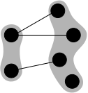

# Modularity value range

> **🚨 This page is a work in progress.**

> 🕑 **TL;DR**: Modularity $Q\in [-0.5, 1]$.

Going through the [examples](./examples.md), you may have wondered what a "good" or "bad" modularity value really is. Here, we will discuss the value range of the modularity measure.

Modularity is zero if the fraction of edges within communities is no different from the respective fraction we would expect in a random graph. **We get a positive value if this fraction is higher than expected on the basis of chance**. This directly results from our definition of modularity.
In the simple network presented [here](./formula.md#motivation), $Q$ was around $0.13$ which is still slightly better than at random but nevertheless worse than
the best result of $Q \approx 0.46$ for that particular graph.

## Upper limit $1$

In theory, the maximum possible modularity value is $1$ for a graph with infinitely many communities, such that $a^2_c \rightarrow 0$. We show this property for a graph with $t \coloneqq \lvert \Cs \rvert$ communities, each forming a $K_2$ graph, i. e. two vertices sharing one edge.

<figure class="center">
    
    <figcaption>Infinite graph and community assignment yielding the upper limit of modularity: $1$</figcaption>
</figure>

This graph has $t$ communities as well as $m = t$ edges. When $t$ approaches infinity, we obtain:

$$
\begin{align}
Q &= \lim_{t\rightarrow \infty} \frac{1}{2t} \sum_{c=1}^t
\sum_{u\in c} \sum_{v\in c} \left( A_{uv} - \frac{k_u k_v}{2t} \right)\\
&= \lim_{t\rightarrow \infty} \frac{1}{2t} \sum_{c=1}^t \bigl( 2\cdot 1 - 4 \cdot \frac{1\cdot 1}{2t}\bigr)\\
&= \lim_{t\rightarrow \infty} \frac{1}{2t} \sum_{c=1}^t 2
= \lim_{t\rightarrow \infty} \frac{2t}{2t} = 1
\end{align}
$$

As $\sum_{c\in Cs} \sum_{u\in c} \sum_{v\in c} A_{uv} \leq 2m$ and $\sum_{c\in Cs} \sum_{u\in c} \sum_{v\in c} \frac{k_u k_v}{2m} \geq 0$ for every graph partitioning, $Q=1$ is indeed the upper limit of modularity.

## Lower limit $-\frac{1}{2}$

The lower limit of modularity is $-\frac{1}{2}$ which is achieved using any bipartite graph $G(U, V, E)$ with the clustering $C = \{ c_U, c_V \}$ (see [here](https://doi.org/10.1109/TKDE.2007.190689)), that is, each cluster encompasses all the vertices of one bipartition of $G$ (the vertex sets $U$ or respectively $V$). The following figure shows the bipartite graph $G(U, V,E)$ with $U = \{ 0, 1 \}$, $V = \{ 2, 3, 4, 5 \}$ and $E = \bigl\{ \{ 0, 2 \}, \{ 0, 3 \}, \{ 1, 4 \} \bigr\}$. The given community assignment yields a modularity of $-\frac{1}{2}$, while the maximum modularity for this particular graph is $Q \approx 0.44$.

<figure class="center">
    
    <figcaption>Bipartite graph and community assignment yielding the lower limit of modularity: $-0.5$</figcaption>
</figure>

## Common values
A rigorous proof that $−0.5 \leq Q(\Cs) \leq 1$ holds true for any undirected and unweighted graph $G$ and any community assignment (clustering) $\Cs$ is presented [here](https://doi.org/10.1109/TKDE.2007.190689). Note however, that for a *given* graph, the maximum achievable modularity is oftentimes not $1$. Newman and
Girvan claim that a typical range for modularity values is from $0.3$ to $0.7$ (see [here](https://doi.org/10.1103%2Fphysreve.69.026113)) with values above $0.3$ indicating a "significant community structure in a network" (see [here](https://doi.org/10.1103/PhysRevE.70.066111)). Whether values above $0.3$ really indicate a good community structure depends on the application and the particular graph.